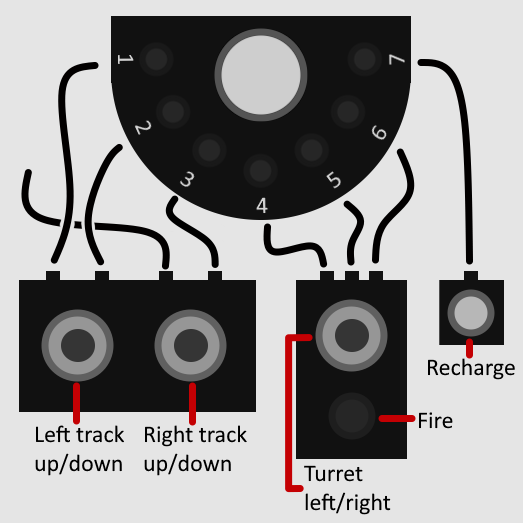
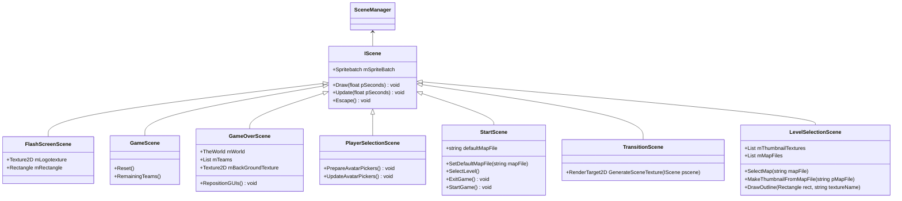
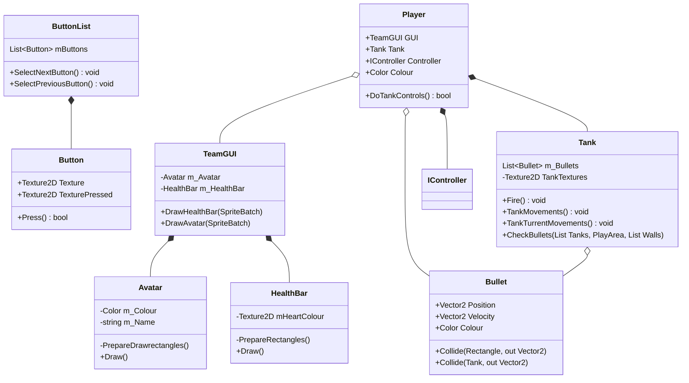

# Troublesome Tanks!

Troublesome tanks is a top down tank shooter where up to four teams of three compete against each other in the hopes of becoming the most troubling tank. However, its never that simple. With the custom controller created by Spooky Elephant, each team has to manage the power of their tank by plugging/unplugging each part of the tank and using their charger to stay topped up on power. Can you maintain strong team work and leverage the powerful pickups to your advantage or will your team become a pile of scrap metal!

## How to Setup and Play

Download the latest release version of Troublesome Tanks from the release tab on the main repository and extract the files. The two main items of interest is the Tankontroller application file and the DGS.txt file in the Content folder. The DGS file allows for changes to be made to certain areas of the game, such as:

- Change the resolution
- Adjust the tank properties such as speed and health
- Change if pickups will spawn as well as what type of pickups can spawn
- What controllers can be used on the main menu and if a keyboard controller is needed

The Tankontroller application is what needs to be run to launch the game.

## The Controls

### Keyboard

These are the controls for the keyboard which can support two players. One player is in red and the other is in blue:

### Controller Controls

The Controllers can be used by multiple people at once and it is recommeneded that each team consists of 3 members:
- The DRIVER -- Responsible for moving the tank around the map
- The GUNNER -- Responsible for move the turret and shooting other players
- The ENGINEER -- Responsible for maintaining the charge of each port

These are the controls for one of the custom controllers:

# Troublesome Tanks - Commercial Development Practice

We were given the opportunity to update and modernise Troublesome Tanks by David Parker. Our main task was refactoring the game to increase the readability of the code and ensure that the game could easily be maintained by future developers. We changed how different classes interacted with each other to reduce coupling and cleaned up any redundant code that had been left over from previous versions which wasn't being used anymore. After giving it a fresh coat of paint, we focused on introducing new features into the game to increase entertainment and quality of life. 

## New Features:
These are the main features which we have added:

- Plug and Play to allow for the adding/removing of controllers
- Map Loading From Json Files. A simple way of adding new maps to the game, but the creation of maps needs simplifying
- Pickups that spawn throughout the map. These currently include:
    - Health
    - Bouncy Bullets
    - Mines
    - Bouncy EMPs
- Pickup screen to explain each pickup to assist players
- Map select screen which allows players to look though each map and choose one to play on
- Updated the lights on the controllers to display the player colour and the charge level of each port
- Brand new controllers developed by David

## Refactoring:
The project has undergone numerous refactoring efforts over the course of the CDP version, this is a brief look into what has been refactored within this repository:

- Controller Code: Adding ID support to the controllers for easier reconnection and preventing bugs with team controllers getting mixed swapped.
- Map Management: Maps now have a dedicated manager to handle the parsing and loading of the Json map files.
- Manager Classes: Manager classes have been implemented for Sound, Collision and other similar aspects of the game to prevent code duplication while improving readability.
- Game Scene / The World class changes.

## Solution Diagrams:
### Scenes - Class Diagram

### GUIs - Class Diagram

