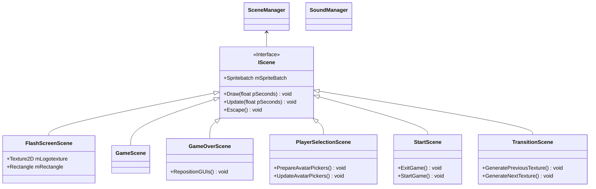

```mermaid
classDiagram
    IScene <|-- FlashScreenScene
    IScene <|-- GameScene
    IScene <|-- GameOverScene
    IScene <|-- PlayerSelectionScene
    IScene <|-- StartScene
    IScene <|-- TransitionScene
    SceneManager <-- IScene
    class SoundManager
    <<Interface>> IScene

    IScene : +Spritebatch mSpriteBatch
    IScene : +Draw(float pSeconds) void
    IScene : +Update(float pSeconds) void
    IScene : +Escape() void

    class FlashScreenScene{
        +Texture2D mLogotexture
        +Rectangle mRectangle
    }
    class GameScene{
        
    }
    class GameOverScene{
        +RepositionGUIs() void
    }
    class PlayerSelectionScene{
        +PrepareAvatarPickers() void
        +UpdateAvatarPickers() void
    }
    class StartScene{
        +ExitGame() void
        +StartGame() void
    }
    class TransitionScene{
        +GeneratePreviousTexture() void
        +GenerateNextTexture() void
    }
```
