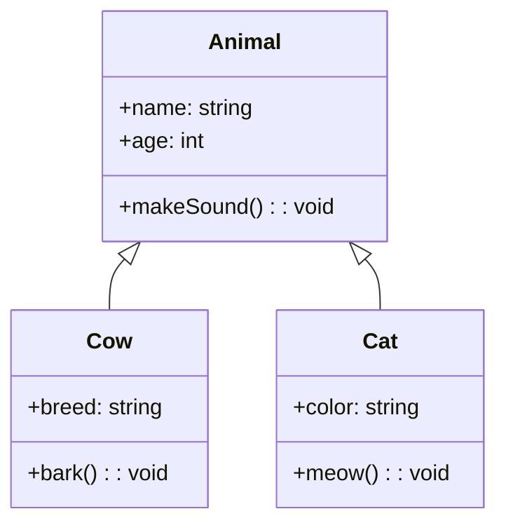

```mermaid
classDiagram
    class Animal {
        +name: string
        +age: int
        +makeSound(): void
    }

    class Cow {
        +breed: string
        +bark(): void
    }

    class Cat {
        +color: string
        +meow(): void
    }

    Animal <|-- Cow
    Animal <|-- Cat

```
