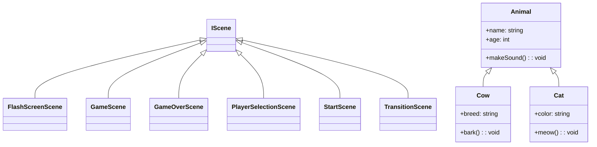

```mermaid
classDiagram
    IScene <|-- FlashScreenScene
    IScene <|-- GameScene
    IScene <|-- GameOverScene
    IScene <|-- PlayerSelectionScene
    IScene <|-- StartScene
    IScene <|-- TransitionScene
    class Animal {
        +name: string
        +age: int
        +makeSound(): void
    }

    class Cow {
        +breed: string
        +bark(): void
    }

    class Cat {
        +color: string
        +meow(): void
    }

    Animal <|-- Cow
    Animal <|-- Cat

```
