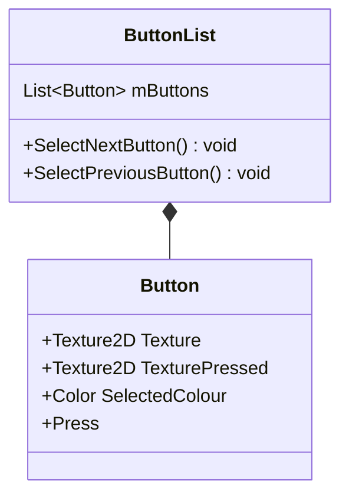

Scenes - Class Diagram

```mermaid
classDiagram
    IScene <|-- FlashScreenScene
    IScene <|-- GameScene
    IScene <|-- GameOverScene
    IScene <|-- PlayerSelectionScene
    IScene <|-- StartScene
    IScene <|-- TransitionScene
    SceneManager <-- IScene
    <<Interface>> IScene

    class IScene{
    +Spritebatch mSpriteBatch
    +Draw(float pSeconds) void
    +Update(float pSeconds) void
    +Escape() void
    }
    class FlashScreenScene{
        +Texture2D mLogotexture
        +Rectangle mRectangle
    }
    class GameScene{
        +Setup4Player() void
        +SetupNot4Player() void
        +SetupPlayers() void
    }
    class GameOverScene{
        +RepositionGUIs() void
    }
    class PlayerSelectionScene{
        +PrepareAvatarPickers() void
        +UpdateAvatarPickers() void
    }
    class StartScene{
        +ExitGame() void
        +StartGame() void
    }
    class TransitionScene{
        +GeneratePreviousTexture() void
        +GenerateNextTexture() void
    }
```
GUIs - Class Diagram

```mermaid
classDiagram
    ButtonList *-- Button
    class ButtonList{
        List~Button~ mButtons
        +SelectNextButton() void
        +SelectPreviousButton() void
    }
    class Button{
        +Texture2D Texture
        +Texture2D TexturePressed
        +Color SelectedColour
        +Press
    }
   
```
