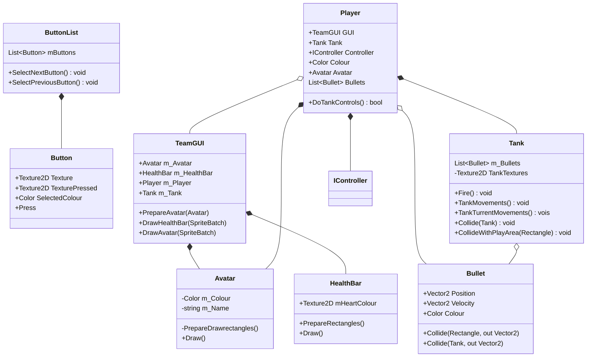

# Troublesome Tanks - Commercial Development Practice

## Description:

Troublesome Tanks is a project created by the Spooky Elephants team, managed by David Parker. This repository is for the CDP version of the project (Commercial Development Practice), the version consists of additions and changes to the code base at the requst of David as the teams client.
The repository is a fork of the 3DP version (3D printed), which is the original repository for the project using the 3D printed controllers. The aim of this project is to create a more feature rich and complete game experience than what was offered before, updating and reworking the exisiting code to allow for new features.

## New Features:
The CDP version of the game has implemented a number of new features, here is a brief list of those features:

- Map Loading From Json Files
- Power Up Abilities
- Map Based Pickup System
- Map Select Screen (Storing Thumbnails of the maps as images!)

It should be of note that not all of these new features are in the main branch as of yet.

## Refactoring:
The project has undergone numerous refactoring efforts over the course of the CDP version, this is a brief look into what has been refactored within this repository:

- Controller Code: Adding ID support to the controllers for easier reconnection and preventing bugs with team controllers getting mixed swapped.
- Map Management: Maps now have a dedicated manager to handle the parsing and loading of the Json map files.
- Manager Classes: Manager classes have been implemented for Sound, Collision and other similar aspects of the game to prevent code duplication while improving readability.
- Game Scene / The World class changes.

It should be of note that not all of these refactoring efforts are in the main branch as of yet.

## Solution Diagrams:
### Scenes - Class Diagram

### GUIs - Class Diagram

